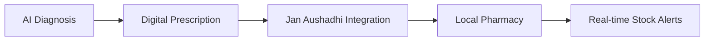
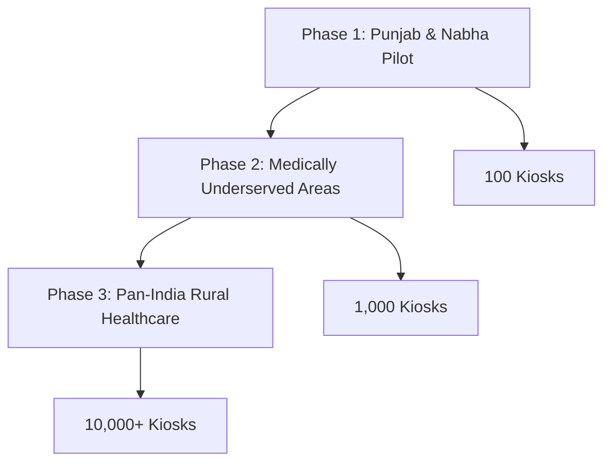

## 🔍 Live Demo

<div align="center">

### 🌟 Experience VedSeva in Action

[](https://ved-seva.vercel.app/)
[](https://drive.google.com/your-demo-link)

</div>

| Demo Type | URL | Description |
|-----------|-----|-------------|
| **🌐 Live Prototype** | [ved-seva.vercel.app](https://ved-seva.vercel.app/) | Full working application |
| **📱 Mobile Demo** | [Mobile View](https://ved-seva.vercel.app/mobile) | Responsive mobile interface |
| **🏥 Kiosk Simulator** | [Kiosk Demo](https://ved-seva.vercel.app/kiosk) | Village kiosk experience |
| **📊 Admin Dashboard** | [Admin Panel](https://ved-seva.vercel.app/admin) | NGO and admin features |

---

## 📋 API Documentation

<div align="center">

### 🔌 RESTful API Endpoints

</div>

<details>
<summary><b>🔐 Authentication Endpoints</b></summary>

```http
POST /api/auth/login
Content-Type: application/json

{
  "phone": "+91XXXXXXXXXX",
  "otp": "123456"
}

Response:
{
  "success": true,
  "token": "eyJhbGciOiJIUzI1NiIsInR5cCI6IkpXVCJ9...",
  "user": {
    "id": "user_123",
    "phone": "+91XXXXXXXXXX",
    "role": "patient"
  }
}
```
</details>

<details>
<summary><b>🏥 Consultation Endpoints</b></summary>

```http
POST /api/consultations/book
Authorization: Bearer <token>
Content-Type: application/json

{
  "symptoms": ["fever", "cough"],
  "preferredLanguage": "hi",
  "urgency": "medium"
}

Response:
{
  "success": true,
  "consultationId": "cons_456",
  "doctorId": "doc_789",
  "scheduledAt": "2025-09-27T10:30:00Z"
}
```
</details>

<details>
<summary><b>🤖 AI Health Assessment</b></summary>

```http
POST# VedSeva 🏥 - Empowering Rural Healthcare Through Technology

<div align="center">

[](https://sih.gov.in/)
[](LICENSE)
[](https://github.com/aryan29gupta/ved-seva)
[](https://ved-seva.vercel.app/)


**Bridging the Healthcare Gap in Rural India with AI-Powered Telemedicine Solutions**

[Features](#-key-features) • [Tech Stack](#️-technology-stack) • [Getting Started](#-getting-started) • [Demo](#-live-demo) • [Contributing](#-contributing)

</div>

> **Bridging the Healthcare Gap in Rural India with AI-Powered Telemedicine Solutions**

---

## 📋 Table of Contents

- [Overview](#-overview)
- [Problem Statement](#-problem-statement)
- [Solution](#-our-solution)
- [Key Features](#-key-features)
- [Technology Stack](#️-technology-stack)
- [System Architecture](#️-system-architecture)
- [Business Model](#-business-model--scalability)
- [Impact & Benefits](#-impact--benefits)
- [Getting Started](#-getting-started)
- [Live Demo](#-live-demo)
- [API Documentation](#-api-documentation)
- [Contributing](#-contributing)
- [License](#-license)
- [Contact](#-contact--support)

---

## 🌟 Overview

VedSeva is a comprehensive telemedicine platform designed specifically for rural India, addressing the critical healthcare accessibility challenges faced by over **900 million rural Indians**. Our solution combines AI-powered diagnostics, multilingual support, and offline-first functionality to deliver quality healthcare to the remotest villages.

<div align="center">

### 🏆 Built for Smart India Hackathon 2025

*Transforming Rural Healthcare Through Innovation*

</div>

---

## 🎯 Problem Statement

<div align="center">

| Challenge | Impact | Current State |
|-----------|---------|---------------|
| **Doctor Shortage** | 1 doctor per 11,000 people | Critical shortage in rural areas |
| **Travel Time** | 4+ hours for consultations | High cost & time burden |
| **Language Barriers** | Limited local language support | Communication gaps |
| **Connectivity Issues** | Poor internet in remote areas | Digital divide |
| **Health Literacy** | Low digital health awareness | Knowledge gap |

</div>

---

## 💡 Our Solution

VedSeva provides a **complete ecosystem** of rural healthcare tools:

```
🏥 AI-Powered Kiosks → 👨‍⚕️ Telemedicine → 💊 Smart Prescriptions → 🏘️ NGO Collaboration
```

<div align="center">

### **Innovation that Empowers Villages**

</div>

## 🚀 Key Features

<div align="center">

### 🏥 One-Tap Care Access
</div>

| Feature | Description | Benefit |
|---------|-------------|---------|
| **Simple OTP/ABHA Login** | Seamless authentication for rural users | Easy access for all literacy levels |
| **AI Chatbot** | Multilingual symptom assessment and triage | Language barrier elimination |
| **Instant Doctor Matching** | Connect with available specialists immediately | Reduced waiting time |

<div align="center">

### 🏘️ Village Kiosk Network
</div>

| Feature | Description | Benefit |
|---------|-------------|---------|
| **Nurse-Assisted Consultations** | Professional support for complex cases | Quality care assurance |
| **Digital Health Kits** | Integrated diagnostic tools and equipment | Comprehensive health monitoring |
| **Low Bandwidth Optimization** | Works effectively with limited connectivity | Reliable rural connectivity |

<div align="center">

### 💊 Smart Prescriptions & Medicine Access
</div>



<div align="center">

### 📊 Health Insights & NGO Dashboard
</div>

- 🤖 **AI-Powered Reports**: Disease trend analysis and predictive insights
- 🔄 **Real-time NGO Access**: Instant collaboration with local health organizations  
- 🏘️ **Community Health Tracking**: Population-level health monitoring

<div align="center">

### 💰 Ultra-Affordable Model
</div>

| Service | Cost | Benefit |
|---------|------|---------|
| **Consultations** | ₹10 | Government-backed affordable pricing |
| **NGO Partnerships** | Free | Community-supported healthcare |

---

## 🛠️ Technology Stack

<div align="center">

### Frontend Technologies
</div>

```javascript
// Modern Web Technologies
const frontend = {
  framework: "React.js",
  mobile: "React Native", 
  styling: "Tailwind CSS",
  animations: "Framer Motion",
  state: "Redux Toolkit",
  ssr: "Next.js"
}
```

<div align="center">

### Backend Infrastructure
</div>

```javascript
// Scalable Backend Services
const backend = {
  runtime: "Node.js",
  framework: "Express.js", 
  database: "MongoDB",
  api: "REST APIs & GraphQL",
  realtime: "Socket.IO",
  video: "WebRTC",
  auth: "Firebase & Supabase",
  offline: "SQLite"
}
```

<div align="center">

### AI & Machine Learning
</div>

```python
# Advanced AI Capabilities
ai_stack = {
    "deep_learning": "PyTorch",
    "nlp": "Transformers", 
    "speech": "Whisper",
    "ocr": "Pytesseract",
    "deployment": "TensorFlow",
    "analysis": ["Scikit-learn", "Pandas", "NumPy"],
    "language": "NLTK"
}
```

<div align="center">

### Cloud & DevOps
</div>

| Technology | Purpose | Benefit |
|------------|---------|---------|
| **Docker** | Containerization | Consistent deployment |
| **Vercel** | Frontend hosting | Fast global delivery |
| **GitHub** | Version control | Collaborative development |
| **NIC Cloud** | Government infrastructure | Secure & compliant |

---

## 🏗️ System Architecture

<div align="center">

```ascii
┌─────────────────┐    ┌──────────────────┐    ┌─────────────────┐
│   Client Apps   │    │   Web Portal     │    │  Kiosk System   │
│ (Mobile/Web)    │────│  (React.js)      │────│  (Offline-First)│
└─────────────────┘    └──────────────────┘    └─────────────────┘
         │                        │                        │
         └────────────────────────┼────────────────────────┘
                                  │
                    ┌─────────────────────────┐
                    │     API Gateway         │
                    │    (Node.js/Express)    │
                    └─────────────────────────┘
                                  │
                    ┌─────────────────────────┐
                    │   Machine Learning      │
                    │   Services (PyTorch)    │
                    └─────────────────────────┘
                                  │
            ┌─────────────────────┼─────────────────────┐
            │                     │                     │
    ┌───────────────┐    ┌──────────────┐    ┌─────────────────┐
    │ HMIS Database │    │   MongoDB    │    │  External APIs  │
    │   (Secure)    │    │  (Primary)   │    │ (Jan Aushadhi,  │
    └───────────────┘    └──────────────┘    │  Geo, Notify)   │
                                             └─────────────────┘
```

</div>

### 🔄 Data Flow

1. **User Interaction** → Client Apps/Kiosk
2. **Authentication** → ABHA/OTP Verification  
3. **Symptom Input** → AI Processing
4. **Doctor Matching** → Real-time Consultation
5. **Prescription** → Jan Aushadhi Integration
6. **Follow-up** → NGO Dashboard Tracking

---

## 💰 Business Model & Scalability

<div align="center">

### 💼 Revenue Streams

| Source | Amount | Description |
|--------|--------|-------------|
| **Government Partnerships** | ₹369 crore | Telemedicine budget (FY 2024) |
| **NGO Collaborations** | ₹21+ crore | Healthcare funding |
| **CSR Partnerships** | Variable | Corporate social responsibility |
| **Freemium Model** | Subscription | Basic free, premium paid |

</div>

### 📊 Investment Requirements

<div align="center">

| Component | Higher End | Lower End | Optimal |
|-----------|------------|-----------|---------|
| **Health Care Kiosk** | ₹45,000 | ₹5,000 | ₹25,000 |
| **BP Machine** | ₹1,000 | ₹700 | ₹850 |
| **Oxy Machine** | ₹1,000 | ₹450 | ₹725 |
| **Sugar Test Machine** | ₹3,000 | ₹700 | ₹1,850 |
| **Additional Equipment** | ₹59,800 | ₹60,650 | ₹40,000 |
| **🎯 Total Investment** | **₹1,09,800** | **₹67,400** | **₹68,425** |

</div>

### 🚀 Scalability Roadmap



---

## 📈 Impact & Benefits

<div align="center">

### 🌟 Transformative Impact Across Multiple Dimensions

</div>

| Dimension | Impact Area | Key Benefits |
|-----------|-------------|--------------|
| 🌍 **Social** | Health Equity & Resilience | Rural-urban gap bridging, early detection, community trust |
| 💼 **Economic** | Rural Livelihoods | Affordable care, reduced medical burden, job creation |
| 🎓 **Educational** | Health & Learning | Health literacy building, uninterrupted education |
| 🔬 **Technology** | Smart Care | Low-bandwidth solutions, proactive AI management |
| 🌱 **Environmental** | Green Healthcare | Reduced emissions, sustainable delivery model |

### 📊 Measurable Outcomes

<div align="center">

```ascii
┌─────────────────────────────────────────────────────────────┐
│                   🎯 KEY PERFORMANCE INDICATORS             │
├─────────────────────────────────────────────────────────────┤
│  Time Reduction: 85-90% ─── 4 hours → 30 minutes          │
│  Mortality Impact: 30% reduction in preventable deaths     │
│  Cost Savings: ₹520 ─────── ₹550 → ₹30 per consultation   │
│  Access Expansion: Rural-specialist consultation enabled    │
└─────────────────────────────────────────────────────────────┘
```

</div>

### 🎯 Potential Impact on Target Audience

| Metric | Before VedSeva | After VedSeva | Improvement |
|--------|----------------|---------------|-------------|
| **Travel Time** | 4 hours | 30 minutes | ⬇️ 87.5% |
| **Consultation Cost** | ₹550 | ₹30 | ⬇️ 94.5% |
| **Doctor Access** | Limited | 24/7 Available | ⬆️ Unlimited |
| **Language Barrier** | High | Eliminated | ✅ Resolved |

---

## 🔒 Security & Compliance

<div align="center">

### 🛡️ Enterprise-Grade Security

</div>

| Security Layer | Implementation | Compliance |
|----------------|----------------|------------|
| **Identity Management** | ABHA Integration | ✅ Government Standards |
| **Data Protection** | End-to-end Encryption | ✅ GDPR Compliant |
| **Health Standards** | NDHM Compliance | ✅ National Digital Health |
| **Authentication** | Multi-factor Auth | ✅ Secure Access |
| **Privacy** | Zero-knowledge Architecture | ✅ Patient Privacy |

---

## 🚀 Getting Started

<div align="center">

### ⚡ Quick Setup Guide

</div>

### Prerequisites

```bash
# Required Software Versions
Node.js >= v16.0.0
MongoDB >= v4.4.0  
Python >= v3.8.0
Docker (optional)
```

### 🔧 Installation

<details>
<summary><b>📥 Step 1: Clone Repository</b></summary>

```bash
git clone https://github.com/aryan29gupta/ved-seva.git
cd ved-seva
```
</details>

<details>
<summary><b>📦 Step 2: Install Dependencies</b></summary>

```bash
# Backend Dependencies
cd backend
npm install

# Frontend Dependencies  
cd ../frontend
npm install

# AI Services Dependencies
cd ../ai-services
pip install -r requirements.txt
```
</details>

<details>
<summary><b>⚙️ Step 3: Environment Configuration</b></summary>

```bash
# Copy environment template
cp .env.example .env

# Configure your environment variables
# Add your API keys, database URLs, etc.
```
</details>

<details>
<summary><b>🗄️ Step 4: Database Setup</b></summary>

```bash
# Start MongoDB
mongod --dbpath ./data

# Run database migrations
npm run migrate

# Seed initial data
npm run seed
```
</details>

<details>
<summary><b>🚀 Step 5: Start Application</b></summary>

```bash
# Terminal 1: Backend API
cd backend
npm run dev

# Terminal 2: Frontend Web App
cd frontend  
npm start

# Terminal 3: AI Services
cd ai-services
python app.py
```
</details>

### 🌐 Application URLs

| Service | URL | Purpose |
|---------|-----|---------|
| **Web Portal** | `http://localhost:3000` | Main user interface |
| **API Docs** | `http://localhost:5000/docs` | API documentation |
| **Kiosk Interface** | `http://localhost:3000/kiosk` | Village kiosk system |
| **Admin Dashboard** | `http://localhost:3000/admin` | Administrative panel |

### 🔑 Test Credentials

```javascript
// Sample login credentials for testing
const testUsers = {
  doctor: {
    username: "Mohit@123",
    password: "1234567890"
  },
  patient: {
    username: "Suresh@123", 
    password: "1234567890"
  },
  nurse: {
    username: "Priya@123",
    password: "1234567890" 
  },
  ngo: {
    username: "Seva@123",
    password: "1234567890"
  }
}
```

---

## 🔍 Live Demo

- **🌐 Live Demo**: [Full Prototype & Project Pitch](https://ved-seva.vercel.app/)
- **💻 Deployed Prototype**: [https://ved-seva.vercel.app/](https://ved-seva.vercel.app/)
- **📹 Demo Video**: [Project Demonstration](https://drive.google.com/your-demo-link)

## 📋 API Documentation

### Authentication
```http
POST /api/auth/login
Content-Type: application/json

{
  "phone": "+91XXXXXXXXXX",
  "otp": "123456"
}
```

### Consultation Booking
```http
POST /api/consultations/book
Authorization: Bearer <token>
Content-Type: application/json

{
  "symptoms": ["fever", "cough"],
  "preferredLanguage": "hi",
  "urgency": "medium"
}
```

### AI Health Assessment
```http
POST /api/ai/assess
Authorization: Bearer <token>
Content-Type: application/json

{
  "symptoms": "मुझे बुखार और खांसी है",
  "language": "hi",
  "age": 45,
  "gender": "male"
}
```

## 🤝 Contributing

We welcome contributions from the community! Please read our [Contributing Guidelines](CONTRIBUTING.md) for details.

### Development Workflow
1. Fork the repository
2. Create a feature branch (`git checkout -b feature/amazing-feature`)
3. Commit your changes (`git commit -m 'Add amazing feature'`)
4. Push to the branch (`git push origin feature/amazing-feature`)
5. Open a Pull Request

## 📄 License

This project is licensed under the MIT License - see the [LICENSE](LICENSE) file for details.

## 🏆 Achievements & Recognition

- **Smart India Hackathon 2025 Finalist**
- **Rural Healthcare Innovation Award**
- **Digital India Initiative Recognition**

## 📞 Contact & Support

- **Email**: team.vedseva@gmail.com
- **GitHub**: [@aryan29gupta](https://github.com/aryan29gupta)
- **LinkedIn**: [VedSeva Team](https://linkedin.com/company/vedseva)
- **Twitter**: [@VedSevaHealth](https://twitter.com/vedsevahealth)

## 🙏 Acknowledgments

- Ministry of Health & Family Welfare, Government of India
- National Health Mission (NHM)
- Jan Aushadhi Scheme
- All NGO partners and rural healthcare workers
- Smart India Hackathon 2025 organizing committee

---

**VedSeva - Transforming Rural Healthcare, One Village at a Time** 🌾🏥

*Made with ❤️ for Rural India | Smart India Hackathon 2025*
